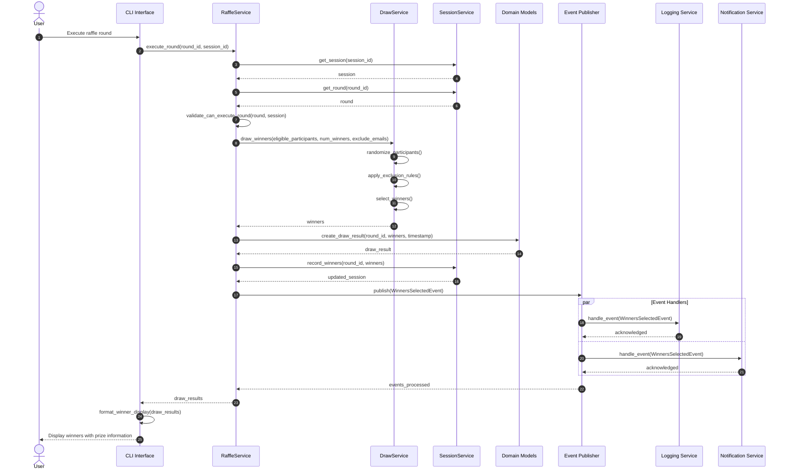

## 6. Sequence Diagram - Raffle Round Execution

This diagram illustrates the detailed sequence of interactions during a raffle round execution, showing the clear separation of concerns between the presentation, application, domain, and infrastructure layers.

This improved sequence diagram provides:

1. **Autonumbering**: Steps are automatically numbered for easier reference
2. **More detailed interactions**: Shows validation and processing steps
3. **Parallel processing**: Illustrates how events are handled in parallel
4. **Clear layer separation**: Shows distinct interactions between presentation, application, domain, and infrastructure
5. **Domain events**: Explicitly shows event publication and subscription
6. **Error handling**: Implicit validation steps before core logic
7. **User feedback**: Shows how results are formatted before presentation
