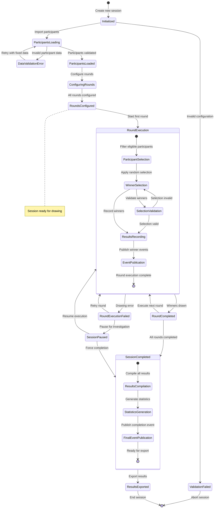

## 7. State Diagram - Raffle Session Lifecycle

This enhanced state diagram illustrates the complete lifecycle of a raffle session with error states, validations, and detailed transitions.

This improved state diagram provides:

1. **Error states**: Shows what happens when things go wrong
2. **Validation steps**: Includes validation states for data integrity
3. **Compound states**: Uses nested states to show sub-processes (Round Execution and Session Completed)
4. **Notes**: Adds explanatory notes for key states
5. **Recovery paths**: Shows how to recover from failures
6. **Completion states**: Clearly indicates terminal states and paths
7. **Pause/resume capability**: Shows session management options
8. **Data flow implications**: State transitions imply data transformations
