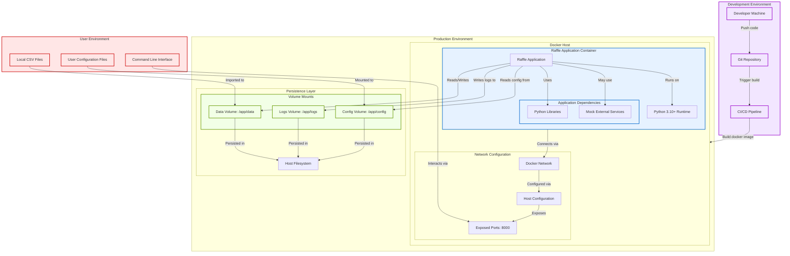

## 8. Deployment Diagram

This enhanced deployment diagram illustrates the complete deployment architecture for the raffle application, including containerization, volume management, networking, and runtime dependencies.

This improved deployment diagram provides:

1. **Complete environment mapping**: Shows development, production, and user environments
2. **Build process**: Includes the CI/CD process from code to deployment
3. **Containerization details**: More explicit Docker configuration information
4. **Volume management**: Enhanced volume configuration with specific mount points
5. **Network configuration**: Shows how the application is exposed to users
6. **Dependency management**: Clearer representation of runtime dependencies
7. **User interaction**: Shows how users interact with the deployed application
8. **Data flow**: Visualizes how data moves between environments
9. **Enhanced styling**: Improved visual differentiation between components
