## 9. Event Flow Diagram

This enhanced event flow diagram illustrates the complete event-driven architecture of the raffle application, showing how domain events propagate through the system.

```mermaid
flowchart TD
    %% Event sources
    User(["User Actions"])
    System(["System Triggers"])

    %% Publishers
    subgraph Publishers["Event Publishers"]
        direction TB
        ParticipantService["Participant Service"]
        RaffleService["Raffle Service"]
        DrawService["Draw Service"]
        SessionService["Session Service"]
    end

    %% Event bus
    EventPublisher["Domain Event Publisher"]

    %% Domain Events
    subgraph DomainEvents["Domain Events"]
        direction TB
        ParticipantImported["ParticipantImportedEvent"]
        RoundCreated["RoundCreatedEvent"]
        WinnersSelected["WinnersSelectedEvent"]
        SessionStarted["SessionStartedEvent"]
        SessionCompleted["SessionCompletedEvent"]
        ValidationFailed["ValidationFailedEvent"]
    end

    %% Subscribers
    subgraph Subscribers["Event Subscribers"]
        direction TB
        LoggingSubscriber["Logging Subscriber"]
        NotificationSubscriber["Notification Subscriber"]
        AuditSubscriber["Audit Subscriber"]
        MetricsSubscriber["Metrics Subscriber"]
        PersistenceSubscriber["Persistence Subscriber"]
    end

    %% Outputs
    Logs[("Log Files")]
    Notifications[("User Notifications")]
    AuditTrail[("Audit Records")]
    Metrics[("Performance Metrics")]
    Database[("Persistent Storage")]

    %% Event triggers
    User --> ParticipantService
    User --> RaffleService
    System --> SessionService
    System --> DrawService

    %% Publishing relationships
    ParticipantService -- "publishes" --> EventPublisher
    RaffleService -- "publishes" --> EventPublisher
    DrawService -- "publishes" --> EventPublisher
    SessionService -- "publishes" --> EventPublisher

    %% Event distribution
    EventPublisher -- "distributes" --> DomainEvents

    %% Event registration
    DomainEvents -- "received by" --> Subscribers

    %% Event type mapping
    ParticipantService -- "creates" --> ParticipantImported
    RaffleService -- "creates" --> RoundCreated
    RaffleService -- "creates" --> SessionStarted
    RaffleService -- "creates" --> SessionCompleted
    DrawService -- "creates" --> WinnersSelected
    Publishers -- "may create" --> ValidationFailed

    %% Subscriber responsibilities
    LoggingSubscriber -- "handles" --> Logs
    NotificationSubscriber -- "handles" --> Notifications
    AuditSubscriber -- "handles" --> AuditTrail
    MetricsSubscriber -- "handles" --> Metrics
    PersistenceSubscriber -- "handles" --> Database

    %% Subscription mapping
    ParticipantImported -- "subscribed by" --> LoggingSubscriber & AuditSubscriber
    RoundCreated -- "subscribed by" --> LoggingSubscriber & PersistenceSubscriber
    WinnersSelected -- "subscribed by" --> LoggingSubscriber & NotificationSubscriber & AuditSubscriber & PersistenceSubscriber
    SessionStarted -- "subscribed by" --> LoggingSubscriber & MetricsSubscriber
    SessionCompleted -- "subscribed by" --> LoggingSubscriber & AuditSubscriber & MetricsSubscriber & PersistenceSubscriber
    ValidationFailed -- "subscribed by" --> LoggingSubscriber & NotificationSubscriber

    %% Styling
    classDef publisher fill:#ffcccc,stroke:#ff6666,stroke-width:2px
    classDef event fill:#ccffcc,stroke:#66ff66,stroke-width:2px
    classDef subscriber fill:#ccccff,stroke:#6666ff,stroke-width:2px
    classDef output fill:#ffffcc,stroke:#ffff66,stroke-width:2px
    classDef trigger fill:#ffccff,stroke:#ff66ff,stroke-width:2px

    class Publishers,ParticipantService,RaffleService,DrawService,SessionService publisher
    class DomainEvents,ParticipantImported,RoundCreated,WinnersSelected,SessionStarted,SessionCompleted,ValidationFailed event
    class Subscribers,LoggingSubscriber,NotificationSubscriber,AuditSubscriber,MetricsSubscriber,PersistenceSubscriber subscriber
    class Logs,Notifications,AuditTrail,Metrics,Database output
    class User,System trigger
```

This improved event flow diagram provides:

1. **Complete event lifecycle**: Shows the full journey from trigger to output
2. **Event triggering**: Displays what actions cause events to be published
3. **Event bus pattern**: Illustrates how the publisher mediates event distribution
4. **Detailed event types**: Shows all major domain events in the system
5. **Extended subscriber ecosystem**: Includes metrics and persistence subscribers
6. **Output destinations**: Shows where event data ultimately ends up
7. **Subscription mapping**: Explicitly shows which events each subscriber handles
8. **Enhanced styling**: Visual differentiation between component types
9. **Directional subgraphs**: Uses internal direction to improve layout
10. **Bidirectional relationships**: Shows both creation and handling relationships
