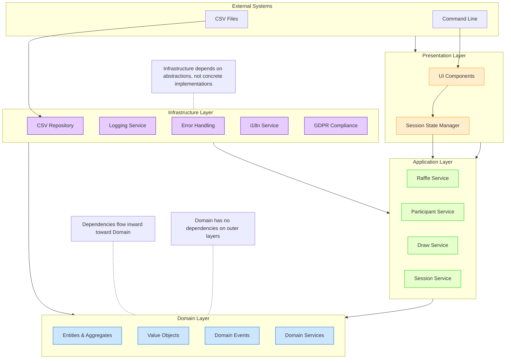
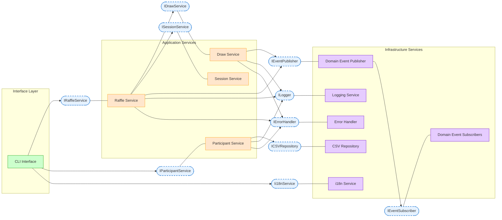
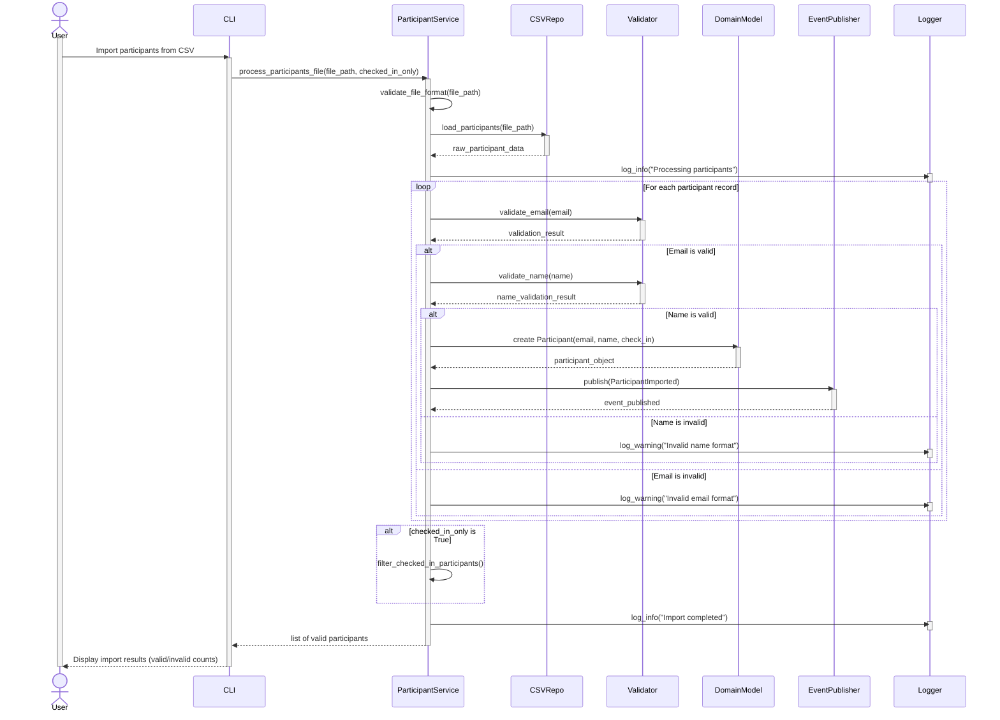
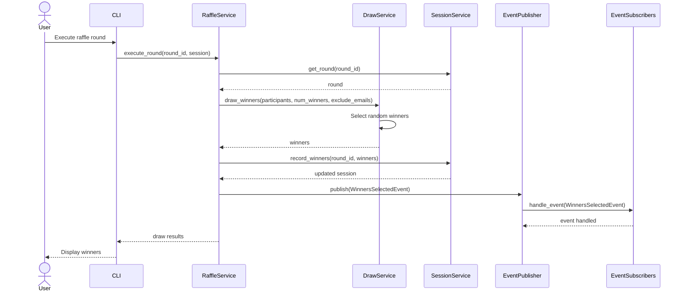
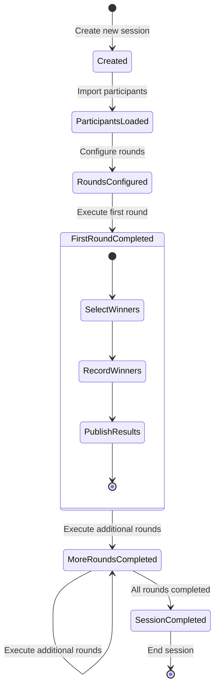
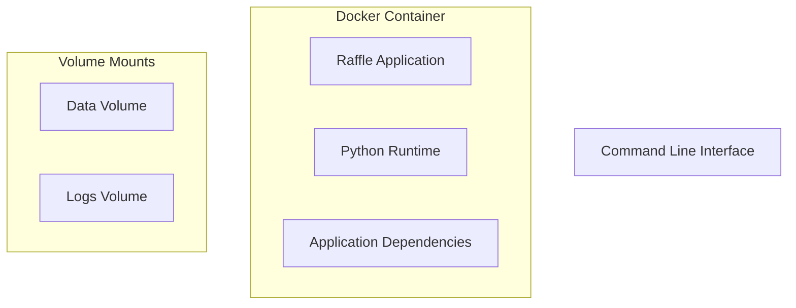
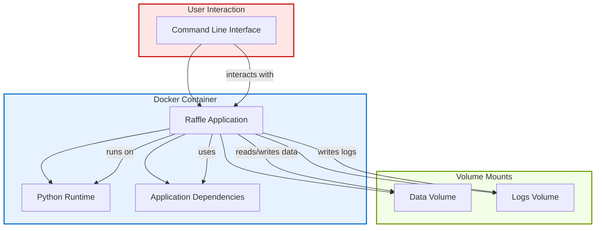
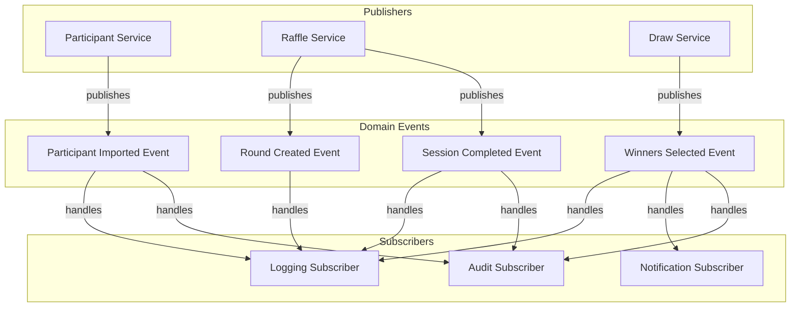
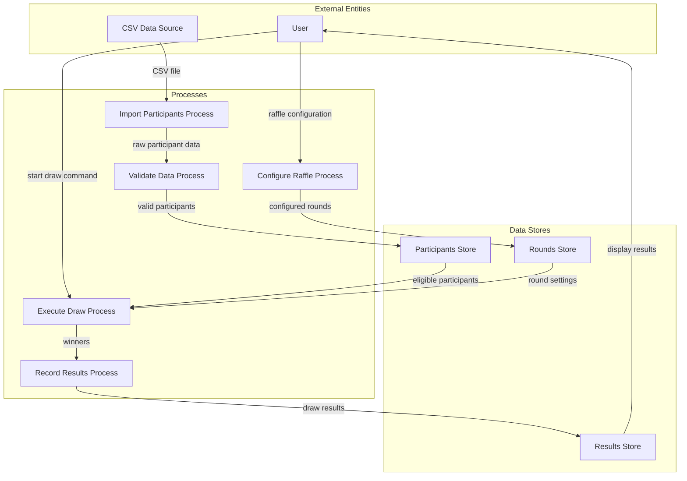

# Raffle Project Documentation Diagrams

## 1. Domain Model Diagram

This diagram illustrates the core entities, value objects, and their relationships in the domain-driven design approach.

```mermaid
classDiagram
    %% Core Entities with improved styling
    class Participant {
        <<Entity>>
        +Email email
        +PersonName name
        +CheckInDate checked_in_at
        +from_dict(data)
        +to_dict()
        +full_name()
        +is_checked_in()
    }

    class Prize {
        <<Entity>>
        +PrizeId prize_id
        +PrizeName name
        +String description
        +create(id, name, description)
    }

    class Round {
        <<Entity>>
        +RoundId round_id
        +String name
        +int num_winners
        +List~Prize~ prizes
        +create_new(round_id, name, num_winners)
        +add_prize(prize)
        +to_dict()
    }

    class DrawResult {
        <<Entity>>
        +int round_id
        +List~Participant~ winners
        +Datetime timestamp
        +to_dict()
    }

    class RaffleSession {
        <<Aggregate Root>>
        +SessionId id
        +List~Participant~ participants
        +List~Round~ rounds
        +List~Email~ all_winners
        +Dict~int, List~Participant~~ drawn_winners
        +create_new()
        +add_participant(participant)
        +add_round(round)
        +record_winners(round_id, winners)
        +is_previous_winner(email)
    }

    %% Value Objects with improved styling
    class ValueObject {
        <<abstract>>
        +T value
        +equals(other)
    }

    class Email {
        <<Value Object>>
        +String value
        +is_valid_email(email)
        +validate()
    }

    class PersonName {
        <<Value Object>>
        +String first_name
        +String last_name
        +full_name()
        +validate()
    }

    class CheckInDate {
        <<Value Object>>
        +String value
        +Optional~Datetime~ _parsed_datetime
        +parsed_datetime()
        +is_checked_in()
        +validate()
    }

    class SessionId {
        <<Value Object>>
        +String value
        +generate()
        +validate()
    }

    class RoundId {
        <<Value Object>>
        +int value
        +validate()
    }

    class PrizeId {
        <<Value Object>>
        +int value
        +validate()
    }

    class PrizeName {
        <<Value Object>>
        +String value
        +validate()
    }

    %% Domain Events for completeness
    class DomainEvent {
        <<Domain Event>>
        +String event_id
        +Datetime timestamp
        +event_type()
    }

    class WinnerSelectedEvent {
        <<Domain Event>>
        +String round_id
        +List~Participant~ winners
        +to_dict()
    }

    %% Relationships
    ValueObject <|-- Email
    ValueObject <|-- PersonName
    ValueObject <|-- CheckInDate
    ValueObject <|-- SessionId
    ValueObject <|-- RoundId
    ValueObject <|-- PrizeId
    ValueObject <|-- PrizeName

    DomainEvent <|-- WinnerSelectedEvent

    Participant --* Email : contains
    Participant --* PersonName : contains
    Participant --* CheckInDate : contains

    RaffleSession --* SessionId : identified by
    RaffleSession o-- "0..*" Participant : contains
    RaffleSession o-- "0..*" Round : contains
    RaffleSession o-- "0..*" DrawResult : records

    Round --* RoundId : identified by
    Round o-- "0..*" Prize : contains

    Prize --* PrizeId : identified by
    Prize --* PrizeName : contains

    DrawResult --o RoundId : references
    DrawResult o-- "1..*" Participant : includes

    %% Add colors for better visualization
    classDef entity fill:#f9f,stroke:#333,stroke-width:2px
    classDef valueObject fill:#bbf,stroke:#33c,stroke-width:1px
    classDef aggregateRoot fill:#fbb,stroke:#c33,stroke-width:3px
    classDef domainEvent fill:#bfb,stroke:#3c3,stroke-width:1px

    class Participant,Prize,Round,DrawResult entity
    class Email,PersonName,CheckInDate,SessionId,RoundId,PrizeId,PrizeName valueObject
    class RaffleSession aggregateRoot
    class DomainEvent,WinnerSelectedEvent domainEvent
```

**Legend:**

- **Aggregate Root**: Main entity that ensures consistency boundaries
- **Entity**: Object with an identity that persists over time
- **Value Object**: Immutable object defined only by its attributes
- **Domain Event**: Something significant that occurred in the domain

## 2. Architecture Diagram

This diagram illustrates the layered architecture pattern with clear separation of concerns, following SOLID principles and clean architecture concepts.



**Legend:**

- **Presentation Layer**: User interface components
- **Application Layer**: Application services that orchestrate domain objects
- **Domain Layer**: Core business logic and rules
- **Infrastructure Layer**: Technical capabilities and external systems integration

## 3. Flow Diagram - Raffle Process

This diagram shows the comprehensive flow of executing a raffle, with improved organization and additional details.

```mermaid
flowchart TD
    %% Style definitions for better visualization
    classDef start fill:#ccffcc,stroke:#009900,stroke-width:2px
    classDef end fill:#ffcccc,stroke:#990000,stroke-width:2px
    classDef process fill:#e6f2ff,stroke:#0066cc,stroke-width:1px
    classDef decision fill:#fff2cc,stroke:#ffcc00,stroke-width:1px
    classDef dataStore fill:#e6ccff,stroke:#6600cc,stroke-width:1px
    classDef domainEvent fill:#ccffff,stroke:#00cccc,stroke-width:1px

    %% Start and initialization
    Start([Start]) --> LoadParticipantsProcess
    LoadParticipantsProcess[/"Load Participants Process"/] --> LoadParticipants[Load Participants from CSV]
    LoadParticipants --> ValidateParticipants{Validate Each\nParticipant}
    ValidateParticipants -->|Valid| FilterCheckedIn{Filter only\nchecked-in?}
    ValidateParticipants -->|Invalid| HandleInvalidEntries[Log Invalid Entries]
    HandleInvalidEntries --> FilterCheckedIn

    %% Filtering process
    FilterCheckedIn -->|Yes| FilterParticipants[Filter checked-in participants]
    FilterCheckedIn -->|No| ConfigureRoundProcess
    FilterParticipants --> ConfigureRoundProcess

    %% Round configuration
    ConfigureRoundProcess[/"Configure Round Process"/] --> SetupRound[Set Round Name, Number of Winners]
    SetupRound --> AddPrizes[Add Prizes to Round]
    AddPrizes --> ValidateRoundConfig{Validate Round\nConfiguration}
    ValidateRoundConfig -->|Valid| PublishRoundCreatedEvent
    ValidateRoundConfig -->|Invalid| FixRoundConfig[Fix Configuration Issues]
    FixRoundConfig --> ValidateRoundConfig

    %% Round execution preparation
    PublishRoundCreatedEvent[Publish Round Created Event] --> ExecuteRoundProcess
    ExecuteRoundProcess[/"Execute Round Process"/] --> ExcludePreviousWinners[Exclude Previous Winners]
    ExcludePreviousWinners --> CheckEligibleCount{Enough Eligible\nParticipants?}
    CheckEligibleCount -->|Yes| SelectWinners[Randomly Select Winners]
    CheckEligibleCount -->|No| NotEnoughParticipants[Handle Not Enough Participants]
    NotEnoughParticipants --> ConfigureRoundProcess

    %% Winner selection and post-processing
    SelectWinners --> PublishWinnerEvent[Publish Winner Selected Event]
    PublishWinnerEvent --> DisplayWinners[Display Winners]

    %% Results handling
    DisplayWinners --> SaveResults[Save Results to Session]
    SaveResults --> RecordWinnersInDB[(Record Winners in Database)]
    RecordWinnersInDB --> Continue{Another Round?}
    Continue -->|Yes| ConfigureRoundProcess
    Continue -->|No| FinalizeProcess[/"Finalize Process"/]
    FinalizeProcess --> PublishSessionCompleted[Publish Session Completed Event]
    PublishSessionCompleted --> GenerateReport[Generate Final Report]
    GenerateReport --> End([End])

    %% Apply styles
    class Start start
    class End end
    class LoadParticipants,FilterParticipants,SetupRound,AddPrizes,ExcludePreviousWinners,SelectWinners,DisplayWinners,SaveResults,GenerateReport process
    class FilterCheckedIn,ValidateParticipants,ValidateRoundConfig,CheckEligibleCount,Continue decision
    class RecordWinnersInDB dataStore
    class PublishRoundCreatedEvent,PublishWinnerEvent,PublishSessionCompleted domainEvent
```

**Legend:**

- **Process**: Standard operations in the flow
- **Decision**: Points where flow branches based on conditions
- **Data Store**: Persistence operations
- **Domain Event**: Events published to notify other parts of the system

## 4. Component Diagram

This diagram shows how the different components interact within the system, following the SOLID principles and highlighting dependencies.



**Legend:**

- **Interfaces**: Abstractions that components depend on (dotted borders)
- **Component**: UI interface components
- **Service**: Application services that implement business logic
- **Infrastructure**: Technical capabilities and external integrations

## 5. Sequence Diagram - Participant Import Process

This diagram shows an enhanced view of the participant import process with added validation and error handling.



**Note:** This sequence diagram includes additional validation steps, error handling, and event publishing that reflect a robust implementation.

## 6. Sequence Diagram - Raffle Round Execution



## 7. State Diagram - Raffle Session Lifecycle



## 8. Deployment Diagram





## 9. Event Flow Diagram



## 10. Data Flow Diagram


